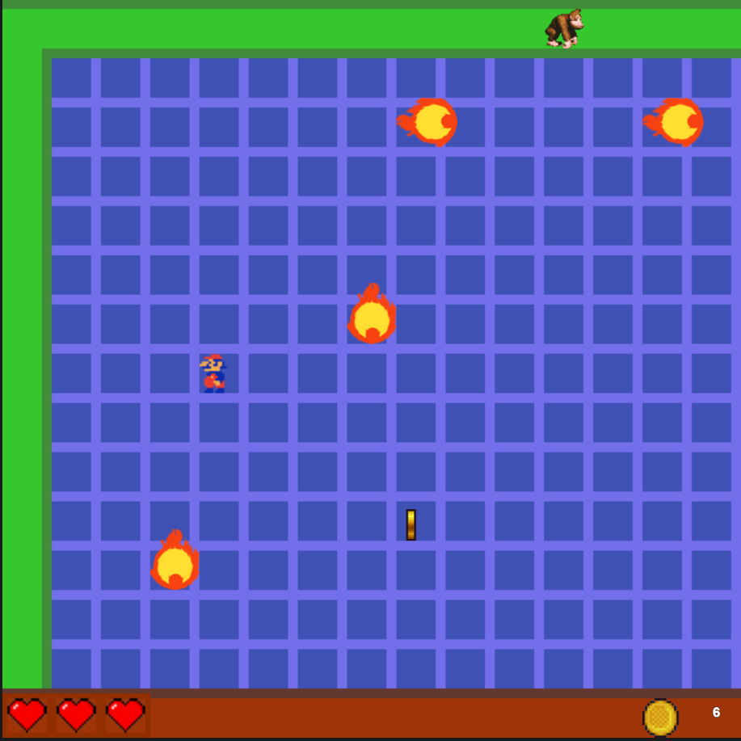

# 🎮 Kongi Donk 🎮

## 📜 Descripción del Juego
¡Un bullet hell de recolección de monedas! 🪙  
Agarrá la mayor cantidad de monedas mientras esquivás proyectiles para no perder vidas. ¿Cuántas monedas podrás recolectar antes de caer? 🚀

## 👥 Equipo de Desarrollo
- Paulo Meira
- Lucía C. Arrieta
- Gonzalo Manuel Arias
- Lara Reeves
- Carolina Villalba

## 🎮 Reglas de Juego / Instrucciones
Controla a tu personaje para moverte en el campo de batalla y evitar los proyectiles:

- **W** o **Flecha Arriba**: Mover hacia arriba ⬆️
- **S** o **Flecha Abajo**: Mover hacia abajo ⬇️
- **A** o **Flecha Izquierda**: Mover hacia la izquierda ⬅️
- **D** o **Flecha Derecha**: Mover hacia la derecha ➡️

¡Recoge monedas y esquiva los obstáculos para ganar! 💰

## 📄 Otros
- **Materia**: Algoritmos 1 - 2°C - 2024
- **Lenguaje**: 
- **Disponibilidad**: Una vez completado, estamos de acuerdo en hacer el repositorio público.

---

🕹️ ¡Diviértete y trata de alcanzar la máxima puntuación en Kongi Donk! 🕹️

